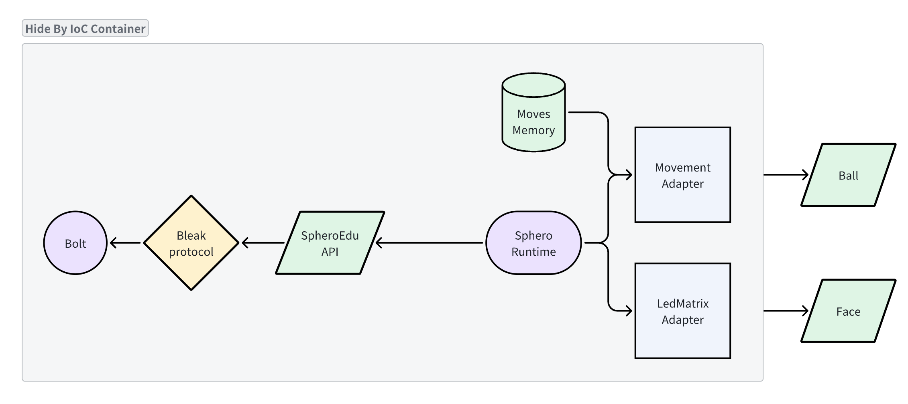

# IoC Container

`GhostOS` 遵循 `面向接口编程` 的思路构建项目.
大多数模块分为 `interface` 与 `implementation`,
通过 [IoC Container](https://github.com/ghost-in-moss/GhostOS/tree/main/ghostos/container.py) (控制反转容器) 来注册与获取实现.

关于 IoC 详见: [Inverse of Control](https://en.wikipedia.org/wiki/Inversion_of_control)

## Why?

在 `Java` 和 `PHP` 的项目中, `IoC Contaienr` 是被大规模使用的. 比如:

* [Java Spring](https://docs.spring.io/spring-framework/docs/3.2.x/spring-framework-reference/html/beans.html)
* [PHP Laravel](https://laravel.com/docs/11.x/container)

但 Python 项目中很少使用, 通常用单例和工厂方法替代.

`GhostOS` 引入 `IoC Container`, 最核心的动机是实现`面向接口编程` 和 `运行时依赖注入`. 我们以 SpheroBoltGPT 为例:

```python
from ghostos.prototypes.spherogpt.bolt import (
    RollFunc,
    Ball,
    Move,
    LedMatrix,
    Animation,
)
from ghostos.core.moss import Moss as Parent


class Moss(Parent):
    body: Ball
    """your sphero ball body"""

    face: LedMatrix
    """you 8*8 led matrix face"""
```

这部分代码会被自动反射成 prompt 提供给大模型. 但其中的 `Ball` 和 `LedMatrix` 在项目正式启动前都不应该实例化.
尤其是当一个 Meta-Agent 需要分析这段代码时, 它不应该在阅读代码时导致创建和 Sphero Bolt 的连接.

所以 `Ball` 和 `LedMatrix` 可以用抽象来设计:

```python
class Ball(ABC):
    """
    Sphero bolt body (which is a rolling ball) control interface.
    """

    @abstractmethod
    def new_move(
            self,
            *,
            run: bool = False,
            animation: Optional[Animation] = None,
    ) -> Move:
        """
        create a new Move instance, to define a sequence of movements.
        :param run: run immediately if True, otherwise the move will not execute until run it.
        :param animation: if animation is not none, it will be played while run the move.
        """
        pass

    @abstractmethod
    def run(self, move: Move, stop_at_first: bool = True) -> None:
        """
        run the bolt ball movement
        :param move: the Move instance that defined the movements by calling it methods one by one.
        :param stop_at_first: shall stop any movement of the ball before executing the new move?
        """
        pass
```

而真正的实例, 只在项目运行时才通过 container 注入:



## Basic Usage

```python
from abc import ABC, abstractmethod
from typing import Type
from ghostos.container import Container, Provider


def test_container_baseline():
    class Abstract(ABC):
        @abstractmethod
        def foo(self) -> int:
            pass

    class Foo(Abstract):
        count = 0

        def foo(self) -> int:
            self.count += 1
            return self.count

    container = Container()

    # set instance
    foo = Foo()
    container.set(Foo, foo)
    assert container.get(Foo) is foo
```

## Provider

通过 `Container.set` 方法注册的实现是单例. 在面向组合的场景中, 需要用 `工厂方法` 来获取依赖生成实例.
这时可以使用 `ghostos.container.Provider`:

```python
from abc import ABC, abstractmethod
from typing import Type
from ghostos.container import Container, Provider


def test_container_baseline():
    class Abstract(ABC):
        @abstractmethod
        def foo(self) -> int:
            pass

    class Foo(Abstract):
        def __init__(self, count):
            self.count = count

        def foo(self) -> int:
            return self.count

    class FooProvider(Provider):

        def singleton(self) -> bool:
            return True

        def contract(self) -> Type[Abstract]:
            return Abstract

        def factory(self, con: Container) -> Abstract:
            # get dependencies from con
            count = con.get("count")
            return Foo(count)

    # register
    container = Container()
    container.set("count", 123)
    container.register(FooProvider())

    # get instance
    foo = container.force_fetch(Abstract)
    assert isinstance(foo, Foo)
    assert foo.foo() is 123
```

此外有语法糖 `ghostos.container.provide` 可以方便封装一个工厂方法为 Provider.

```python
from abc import ABC, abstractmethod
from ghostos.container import Container, provide


class Abstract(ABC):
    @abstractmethod
    def foo(self) -> int:
        pass


class Foo(Abstract):
    def __init__(self, count):
        self.count = count

    def foo(self) -> int:
        return self.count


@provide(Abstract, singleton=True)
def foo_factory(self, con: Container) -> Abstract:
    # get dependencies from con
    count = con.get("count")
    return Foo(count)


# register
container = Container()
container.set("count", 123)
container.register(foo_factory)

# get instance
foo = container.force_fetch(Abstract)
assert isinstance(foo, Foo)
assert foo.foo() is 123
```

## Inheritance

`Container` 是可以嵌套的:

```python
from ghostos.container import Container

container = Container(name="parent")
container.set("foo", "foo")

child_container = Container(parent=container, name="child")
assert child_container.get("foo") == "foo"
```

当一个后代 Container 查找一个注册的依赖时, 如果没找到, 它会递归地去父级 Container 中查找.

此外 `Provider` 也有继承机制:

```python
from ghostos.container import Provider


class MyProvider(Provider):

    def inheritable(self) -> bool:
        return not self.singleton()
```

所有在父级 container 中注册的 `inheritable provider` 也会自动注册到 子级 container.

## Bootstrap and Shutdown

Container 同时可以作为启动和关闭运行的容器.

```python
from ghostos.container import Bootstrapper, Container

container = Container()


class MyBootstrapper(Bootstrapper):
    def bootstrap(self, container: Container) -> None:
        # do something 
        ...


# start all the bootstrapper
container.bootstrap()
```

`Bootstrapper` 也可以用 `ghostos.container.BootstrapProvider` 来定义.

同样的, Container 可以用 `Container.add_shutdown` 注册关闭事件, 调用 `Container.shutdown` 时会依次执行它们.
我们以 `SpheroRuntime` 为例, 它需要全局运行, 作为 [SpheroBolt](https://sphero.com/products/sphero-bolt) 的驱动.

```python


class SpheroBoltProvider(BootstrapProvider):
    """
    Sphero Bolt Provider interface
    """
    ...

    @staticmethod
    def bootstrap(container: Container) -> None:
        # get singleton
        sphero_bolt = container.force_fetch(SpheroBolt)
        if isinstance(sphero_bolt, SpheroBoltImpl):
            # register shutdown method
            container.add_shutdown(sphero_bolt.destroy)
            # bootstrap sphero bolt
            sphero_bolt.bootstrap()

```

## Container Tree

在 `GhostOS` 中, 有不同层级的 Container, 每个 Container 继承自父级 Container, 又管理一个独立的依赖关系.

* 当子级 Container 注册依赖时, 不会污染父级或兄弟级 Container.
* 当子级 Container 销毁的时候, 并不会影响父级或兄弟级 Container.

这样 `Container` 类似于 Python `contextvar`, 可以管理一个独立的运行上下文.

`GhostOS` 里的 Container 继承层级关系如下:

* Root level: [ghostos.bootstrap.app_container](https://github.com/ghost-in-moss/GhostOS/tree/main/ghostos/bootstrap.py)
* GhostOS level: [ghostos.abcd.GhostOS:container](https://github.com/ghost-in-moss/GhostOS/tree/main/ghostos/abcd/concepts.py)
* Shell level: [ghostos.abcd.Shell:container](https://github.com/ghost-in-moss/GhostOS/tree/main/ghostos/abcd/concepts.py)
* Conversation
  level: [ghostos.abcd.Conversation:container](https://github.com/ghost-in-moss/GhostOS/tree/main/ghostos/abcd/concepts.py)
* Moss
  level: [ghostos.core.moss.MossRuntime:container](https://github.com/ghost-in-moss/GhostOS/tree/main/ghostos/core/moss/abcd.py)

在正确的层级注册 Container 和 Provider, 可以用来管理需要继承或隔离的依赖关系. 